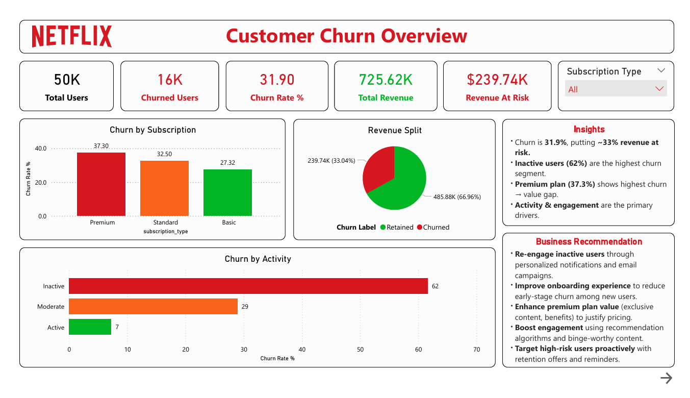
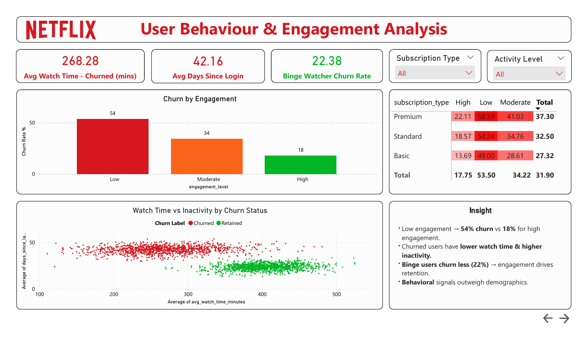
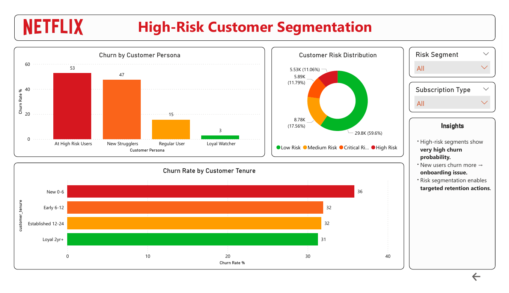

# 🎬 Netflix User Churn Analysis

> An end-to-end data analytics project analysing customer churn behaviour across 50,000 Netflix users using Python, MySQL, Machine Learning, and Power BI.

---

## 📌 Project Overview

Customer churn is one of the most critical business problems for streaming platforms. This project identifies **who churns, why they churn, and what it costs** — using behavioural data to build actionable retention strategies.

**Key Result:** Identified 11,421 high-risk users putting **$239,743/month ($2.87M/year)** in revenue at risk.

---

## 🛠️ Tools & Technologies

| Tool | Purpose |
|---|---|
| Python (Pandas, Seaborn, Scikit-learn) | EDA, visualisation, ML model |
| MySQL | SQL analysis & querying |
| Power BI | Interactive 3-page dashboard |
| Jupyter Notebook | Analysis environment |

---

## 📁 Project Structure

```
netflix-churn-analysis/
│
├── data/
│   ├── netflix_churn_realistic.csv        # Generated dataset (50,000 users)
│   └── netflix_churn_powerbi.csv          # Enriched dataset with ML scores
│
├── notebooks/
│   └── netflix_churn_eda.ipynb            # Full EDA + ML notebook
│
├── sql/
│   └── netflix_churn_queries.sql          # All 10 SQL queries
│
├── reports/
│   ├── Netflix_Churn_SQL_Analysis.pdf    # SQL report with insights
│   └── Netflix_Churn_Dashboard_Final.pdf  # Power BI dashboard export
│
├── charts/
│   ├── chart1_activity_churn.png
│   ├── chart2_engagement_churn.png
│   ├── chart3_heatmap.png
│   ├── chart4_boxplot.png
│   ├── chart5_personas.png
│   ├── chart6_revenue.png
│   ├── confusion_matrix.png
│   └── feature_importance.png
│
└── README.md
```

---

## 📊 Dashboard Preview

### Page 1 — Customer Churn Overview


### Page 2 — User Behaviour & Engagement Analysis


### Page 3 — High-Risk Customer Segmentation


---

## 🔍 Key Findings

### 1. Inactivity is the #1 Churn Driver
| Activity Level | Churn Rate |
|---|---|
| Active (≤20 days) | 7% |
| Moderate (21-40 days) | 29% |
| Inactive (40+ days) | 62% |

> Users inactive for 30+ days are **9x more likely to churn** than active users.

### 2. Engagement Directly Predicts Retention
| Engagement Level | Churn Rate |
|---|---|
| Low watch time | 54% |
| Medium watch time | 34% |
| High watch time | 18% |

### 3. Premium Users Churn Most (Counter-Intuitive)
- Premium: **37.3%** churn
- Standard: **32.5%** churn
- Basic: **27.3%** churn

> High-cost users feel the price is unjustified when engagement drops.

### 4. Revenue Impact
- Total monthly revenue: **$725,620**
- Revenue at risk: **$239,743 (33%)**
- Projected annual risk: **$2,876,916**

### 5. Three Customer Personas
| Persona | Size | Churn Rate | Priority |
|---|---|---|---|
| Loyal Watchers | 8,141 | 2.7% | Protect |
| At-Risk Passives | 4,884 | 72.6% | Intervene urgently |
| New Strugglers | 1,641 | 57.2% | Fix onboarding |

---

## 🤖 Machine Learning Model

**Algorithm:** Random Forest Classifier
**Train/Test Split:** 80/20 (stratified)

| Metric | Score |
|---|---|
| Accuracy | 87% |
| ROC-AUC | 0.94 |
| Precision (Churned) | 85% |
| Recall (Churned) | 73% |

### Top Feature Importances
| Rank | Feature | Importance |
|---|---|---|
| 1 | days_since_last_login | 42% |
| 2 | watch_sessions_per_week | 15% |
| 3 | avg_watch_time_minutes | 10% |
| 4 | completion_rate | 9% |
| 5 | binge_watch_sessions | 8% |

> **Key insight:** Top 5 predictors are all behavioural — demographics have near-zero importance.

### Risk Segmentation (ML Output)
| Segment | Users | Action |
|---|---|---|
| Critical Risk | 5,893 | Immediate outreach |
| High Risk | 5,528 | Re-engagement campaign |
| Medium Risk | 8,781 | Monitor monthly |
| Low Risk | 29,798 | No action needed |

---

## 🗄️ SQL Analysis

10 queries written across two categories:

**Foundation Queries (4):**
- Overall churn rate
- Churn by subscription type
- Churn by activity level
- Revenue at risk

**Advanced Queries (6):**
- High-risk user identification
- Churn by engagement level
- Premium high-risk users
- Churn by customer tenure
- Subscription × engagement cross analysis
- Binge vs non-binge watcher churn

Full queries with results and business insights available in [`reports/Netflix_Churn_SQL_Analysis.pdf`](reports/Netflix_Churn_SQL_Analysis.docx)

---

## 💡 Business Recommendations

1. **Re-engage inactive users** — trigger personalised notification/email after 20 days of inactivity
2. **Fix Premium value gap** — offer exclusive content or subscription pause option
3. **Improve onboarding** — guide new users to relevant content in first 30 days
4. **Promote binge content** — binge watchers churn at half the rate (23% vs 41%)
5. **Target Critical Risk users** — 5,893 users at 99% churn probability need immediate outreach

> A 10% improvement in retention = **$24,000/month recovered ($288,000/year)**

---

## 📂 How to Run

```bash
# Clone the repo
git clone https://github.com/YOUR_USERNAME/netflix-churn-analysis.git

# Install dependencies
pip install pandas numpy matplotlib seaborn scikit-learn

# Open the notebook
jupyter notebook notebooks/netflix_churn_eda.ipynb
```

---

## 👤 Author

**Nilesh Chaudhary**
📧 nileshchaudhary47@gmail.com
🎓 B.Tech Computer Engineering | MBA Information Technology
📜 Google Business Intelligence Professional Certificate

---

*Dataset is synthetically generated with realistic churn patterns for portfolio purposes.*
